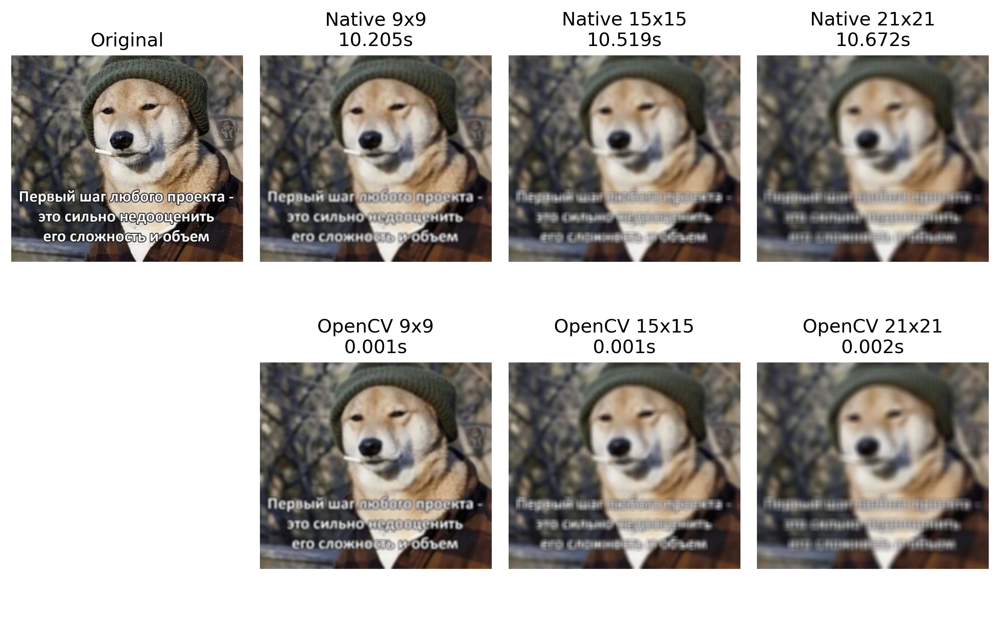

# Лабораторная работа №1

Задание:
- [x] Реализовать программу согласно варианту задания. Базовый алгоритм, используемый в программе, необходимо реализовать в 2 вариантах: 
  - [x] с использованием встроенных функций какой-либо библиотеки (OpenCV, PIL и др.) 
  - [x] нативно на Python или C++
- [x] Сравнить быстродействие реализованных вариантов
- [x] Сделать отчёт в виде readme на GitHub, там же должен быть выложен исходный код.

`Вариант: Усредняющий фильтр Гаусса с переменным размером ядра и параметрами гауссианы.`

# Gaussian Blur Filter (Native vs OpenCV)

**Лабораторная работа №1**  
**Тема:** Усредняющий фильтр Гаусса с переменным размером ядра и параметрами гауссианы  
**Цель:** Реализовать простой алгоритм обработки изображений двумя способами (нативно и с использованием библиотеки), сравнить их быстродействие и проанализировать результаты.

---

## 1. Теоретическая база

### 1.1. Гауссов фильтр

Гауссов фильтр — это линейный фильтр, используемый для сглаживания (размытия) изображений с целью подавления шума и уменьшения детализации. 
Он основан на свёртке исходного изображения с ядром, задаваемым двумерной функцией нормального распределения:


где:  
- x, y — координаты относительно центра ядра,  
- σ — стандартное отклонение (радиус размытия).

На практике коэффициент нормировки часто опускается, так как ядро нормализуется после вычисления, 
чтобы сумма всех его элементов равнялась единице. Это гарантирует сохранение общей яркости изображения после фильтрации.

### 1.2 Параметры фильтра

- **Размер ядра** азмер ядра — нечётное целое число k∈{3,5,7…}, определяющее окно локальной области, участвующей в вычислении нового значения пикселя.  
- **Стандартное отклонение σ** — управляет шириной гауссианы: при малых σ фильтр слабо размывает, при больших — сильнее усредняет окрестность.

### 1.3 Свёртка изображения с ядром

Для каждого пикселя (i,j) выходного изображения выполняется взвешенная сумма значений пикселей в окне размером k×k:

`I_out(i, j) = sum_{u=0}^{k-1} sum_{v=0}^{k-1} I_padded(i + u, j + v) * G(u - c, v - c)`

где:
- k — размер ядра (нечётное целое число),
- c = k // 2 — смещение к центру ядра,
- I_padded — изображение с добавленными границами,
- G — нормализованное гауссово ядро.
---

## 2. Описание разработанной системы

### 2.1 Реализованные методы

Были разработаны два варианта применения Гауссова фильтра:

#### **1) Нативная реализация (Pure Python + NumPy)**

- Генерация ядра: реализована вручную с использованием циклов и экспоненциальной функции.
- Нормализация ядра: сумма элементов ядра приводится к 1.
- Обработка границ: применяется np.pad(..., mode='reflect') для минимизации артефактов.
- Свёртка: выполняется тройным вложенным циклом (по строкам, столбцам и каналам).
- Поддержка как grayscale, так и RGB изображений.
- Все вычисления проводятся в float64, финальный результат приводится к uint8.

#### **2) Реализация с помощью OpenCV**

Используется:

```python
cv2.GaussianBlur(image, (kernel_size, kernel_size), sigma)
```
- OpenCV автоматически обрабатывает многоканальные изображения и оптимизирует вычисления на уровне C++ и SIMD-инструкций.
- Параметры ядра (ksize, sigma) задаются вручную, что обеспечивает честное сравнение с нативной версией.

###  2.2 Архитектура системы
Система состоит из класса `GaussianFilter`, содержащего:
- метод генерации ядра (`gaussian_kernel`)
- нативный фильтр (`native_gaussian_filter`)
- обёртку над OpenCV (`opencv_gaussian_filter`)
- модуль сравнения производительности (`compare_performance`)
- визуализатор результатов (`visualize_results`)

Вход: изображение + список размеров ядра + значение σ
Выход: отфильтрованные изображения, временные метрики, график сравнения


## 3. Результаты тестирования

### 3.1 Тестовые данные
Изображение: test_image.jpg (1920×1080, RGB)
Параметр σ = 1.0
Размеры ядра: 9×9, 15×15, 21×21

### 3.2 Времена выполнения

| Kernel size | Native time | OpenCV time | Speedup     |
|-------------|-------------|-------------|-------------|
| 9×9         | ~10.2 s     | ~0.0010 s   | ×10200      |
| 15×15       | ~10.5 s     | ~0.0010 s   | ×10500      |
| 21×21       | ~10.6 s     | ~0.0019 s   | ×5500       |

Время нативной реализации почти не зависит от размера ядра, так как изображение фиксированного размера, а свёртка выполняется для каждого пикселя независимо. 
Однако накладные расходы на Python-циклы доминируют.

### 3.3 Визуализация
Все отфильтрованные изображения, полученные как нативной реализацией, так и через OpenCV, 
визуально идентичны — различия находятся на уровне машинной точности (менее 1–2 единиц в канале RGB) и не воспринимаются человеческим глазом.



На представленном изображении:
- Первый столбец - исходное изображение (Original)
- Следующие три столбца - результаты применения фильтра Гаусса с ядрами размером 9×9, 15×15 и 21×21
- Верхняя строка - нативная реализация (Pure Python + NumPy), время выполнения указано
- Нижняя строка - реализация через OpenCV, время выполнения также указано

Как видно, увеличение размера ядра практически не влияет на время работы нативной версии, поскольку основная задержка 
связана с интерпретацией циклов в Python, а не с вычислениями свёртки. В то же время OpenCV демонстрирует стабильно 
высокую скорость даже при увеличении ядра.

## 4. Выводы по работе

1. Нативная реализация работает корректно, но **крайне медленно**.  
2. OpenCV быстрее в десятки тысяч раз.  
3. Основное ускорение достигается за счёт C++-оптимизаций и SIMD.  
4. Работа демонстрирует важность использования специализированных библиотек.

## 5. Использованные источники

1. Wikipedia. Gaussian blur. — URL: https://en.wikipedia.org/wiki/Gaussian_blur
2. OpenCV Team. OpenCV Documentation: GaussianBlur. — URL: https://docs.opencv.org/4.x/d4/d13/tutorial_py_filtering.html
3. Harris, C. R., et al. Array padding with numpy.pad. NumPy Documentation. — URL: https://numpy.org/doc/stable/reference/generated/numpy.pad.html  
4. Материалы курса
